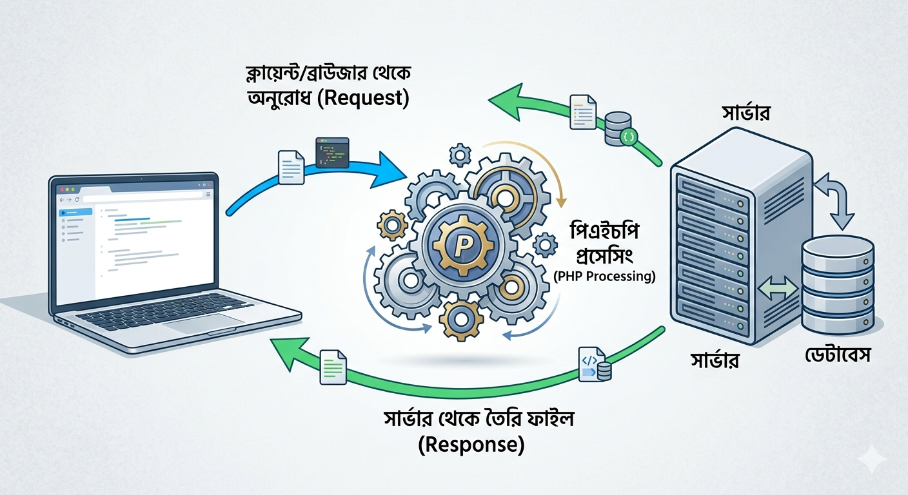

Don't forget to hit the :star: if you like this repo.

## পিএইচপি আসলে কী?

পিএইচপি হলো একটি সার্ভার-সাইড স্ক্রিপ্টিং ল্যাঙ্গুয়েজ। এটি সরাসরি এইচটিএমএল (HTML) এর সাথে মিলেমিশে কাজ করতে পারে। বিষয়টিকে আরও সহজে বুঝতে একটি বাস্তুব উদাহরণের সাহায্য নেওয়া যাক:

**ক্লায়েন্ট-সাইড (Frontend):** এটি হলো একটি বাড়ির রঙ, ডিজাইন বা আসবাবপত্রের মতো—যা আপনি বাইরে থেকে সরাসরি দেখতে পান। ব্রাউজারে HTML, CSS এবং JS এই অংশটি নিয়ন্ত্রণ করে।

**সার্ভার-সাইড (Backend - PHP):** এটি হলো বাড়ির ভেতরের ইলেকট্রিক লাইন, পানির পাম্প বা গ্যাসের পাইপলাইনের মতো। বাইরে থেকে দেখা যায় না, কিন্তু পুরো বাড়িকে সচল রাখে এটাই।

### এটি কীভাবে কাজ করে?

যখন কোনো ইউজার আপনার ওয়েবসাইটে আসে, পিএইচপি সার্ভারে বসে ডেটাবেস থেকে প্রয়োজনীয় তথ্যগুলো খুঁজে বের করে। এরপর সেই তথ্যগুলোকে প্রসেস করে এইচটিএমএল (HTML) আকারে ইউজারের ব্রাউজারে পাঠিয়ে দেয়। এই পুরো প্রক্রিয়াটি এত দ্রুত ঘটে যে, ইউজার টেরই পায় না পর্দার আড়ালে কত বড় একটি প্রসেস সম্পন্ন হলো। যেহেতু এটি সার্ভারে রান করে, তাই ব্রাউজারের 'View Source' দিলে আপনি শুধু এইচটিএমএল দেখতে পাবেন, আসল পিএইচপি কোডটি কখনোই দেখা যাবে না।

## Contribution 🛠️
Please create an [Issue](https://github.com/kaamrul/codearc-php-laravel-bootcamp/issues) for any improvements, suggestions or errors in the content.

You can also contact me using [Linkedin](https://www.linkedin.com/in/kaamrul/) for any other queries or feedback.

