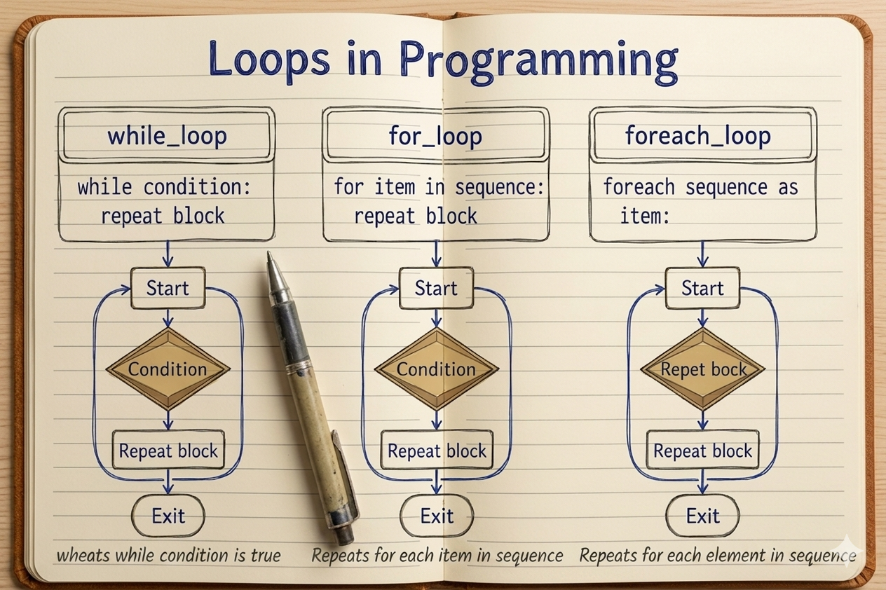

Don't forget to hit the :star: if you like this repo.

# অধ্যায় ৫: লুপ এবং ইটারেসন (PHP Loops & Iteration)

পিএইচপি **লুপ এবং ইটারেসন (Loops & Iteration)** হলো এমন কিছু প্রোগ্রামিং কাঠামো, যার মাধ্যমে কোনো নির্দিষ্ট কোড ব্লক বা নির্দেশনাকে শর্ত সাপেক্ষে বারবার (repeatedly) চালানো যায়। রিয়েল-ওয়ার্ল্ড অ্যাপ্লিকেশনে একই কাজ বারবার ম্যানুয়ালি না লিখে, লুপ ব্যবহার করে কোডের পুনরাবৃত্তি কমানো এবং কোডকে অনেক বেশি সংক্ষিপ্ত ও ডায়নামিক করা সম্ভব হয়।

প্রোগ্রামিংয়ে প্রায়শই আমাদের একই ধরণের ডেটা বা প্রক্রিয়া নিয়ে বারবার কাজ করতে হয়— যেমন একটি অ্যারে বা ডেটাবেস টেবিল থেকে শত শত গ্রাহকের তথ্য স্ক্রিনে ফুটিয়ে তোলা, ১ থেকে ১০০ পর্যন্ত সংখ্যা গণনা করা, কিংবা নির্দিষ্ট শর্ত পূরণ না হওয়া পর্যন্ত কোনো একটি কাজ সচল রাখা। লুপ ছাড়া এই কাজগুলো করতে গেলে একই কোড শতবার লিখতে হতো, যা কোডের সাইজ বাড়াতো এবং রক্ষণাবেক্ষণ কঠিন করে তুলতো। 

পিএইচপিতে বিভিন্ন ধরণের লুপ রয়েছে, যা ভিন্ন ভিন্ন পরিস্থিতির ওপর ভিত্তি করে ব্যবহার করা হয়। কন্ডিশন আগে চেক করা হবে নাকি পরে, অথবা লুপটি কতবার ঘুরবে তা আগে থেকে জানা আছে কিনা— এসব বিষয়ের ওপর ভিত্তি করে সঠিক লুপটি নির্বাচন করা হয়।

सहजभाবে বলতে গেলে:

> সংক্ষেপে বলা যায়, লুপ হলো এমন একটি প্রোগ্রামিং মেকানিজম, যা একই কোড বারবার টাইপ করার ঝামেলা দূর করে একটি নির্দিষ্ট শর্ত সত্য থাকা পর্যন্ত স্বয়ংক্রিয়ভাবে কোড ব্লককে বারবার রান করতে সাহায্য করে।

এটি নির্ধারণ করে:
- লুপের শুরুর মান কত হবে (Initialization)
- কোন শর্ত বা কন্ডিশনে লুপটি চলতে থাকবে (Condition)
- প্রতিবার লুপ ঘোরার পর মানের কী পরিবর্তন হবে (Increment/Decrement)
- কখন লুপের স্বাভাবিক কার্যপ্রবাহ পরিবর্তন হবে (Loop Control)

## 📚 এই অধ্যায়ের বিষয়সমূহ

এই অধ্যায়ে আমরা শিখব:

- **[৫.১ While Loop](5.1-while-loop.md)**
- **[৫.২ Do While Loop](5.2-do-while-loop.md)**
- **[৫.৩ For Loop](5.3-for-loop.md)**
- **[৫.৪ Foreach Loop](5.4-foreach-loop.md)**
- **[৫.৫ নেস্টেড লুপ (Nested Loops)](5.5-nested-loops.md)**
- **[৫.৬ লুপ কন্ট্রোল: ব্রেক এবং কন্টিনিউ (Loop Control: Break & Continue)](5.6-loop-control.md)**

## ফ্লোচার্ট বিশ্লেষণ ও ব্যাখ্যা (Flowchart Explanation)

লুপের কন্ডিশনাল ফ্লো এবং ইটারেশন প্রসেস ভিজ্যুয়ালি এক নজরে বোঝার জন্য নিচের ফ্লোচার্টটি লক্ষ্য করুন:

উপরের ফ্লোচার্টটি লক্ষ্য করলে দেখা যাবে, প্রোগ্রামিংয়ে এই তিনটি লুপের কাজের ধরণ এবং শর্ত যাচাইয়ের প্রক্রিয়া সম্পূর্ণ ভিন্ন ভিন্ন পদ্ধতিতে সম্পন্ন হয়:

#### ১. While Loop (Entry-Controlled Loop)
* **শর্ত প্রথমে যাচাই (Condition First):** ফ্লোচার্টের প্রথম কলামে লক্ষ্য করলে দেখা যাবে, লুপে ঢোকার শুরুতেই `Condition` ডায়মন্ড বক্সটি রয়েছে। অর্থাৎ, কোড ব্লকে প্রবেশ করার আগেই শর্ত যাচাই করা হয়।
* **শর্ত সত্য হলে (True):** যদি কন্ডিশন সত্য হয়, তবেই এটি নিচের দিকে `Repeat block`-এ যায় এবং কোড এক্সিকিউট করে পুনরায় শুরুতে ফিরে এসে আবার শর্ত চেক করে।
* **শর্ত মিথ্যা হলে (False):** শর্ত শুরুতেই মিথ্যা হলে লুপটি সরাসরি `Exit`-এ চলে যায়। এর মানে হলো, শর্ত মিথ্যা হলে `while` লুপের ভেতরের কোড **একবারও রান করবে না**।

#### ২. For Loop (Counter-Based Loop)
* **নির্দিষ্ট পুনরাবৃত্তি (Sequence/Counter Control):** ফ্লোচার্টের দ্বিতীয় কলামে দেখা যাচ্ছে, এটি মূলত একটি নির্দিষ্ট সিকোয়েন্স বা কাউন্টারের ওপর ভিত্তি করে কাজ করে। লুপের শুরুতে একটি নির্দিষ্ট মান নির্ধারণ (Initialization) করা হয়।
* **শর্ত ও মান পরিবর্তন:** প্রতিবার লুপ ঘোরার সময় এটি কন্ডিশন চেক করে এবং কোড ব্লক (`Repeat block`) এক্সিকিউট করার পাশাপাশি স্বয়ংক্রিয়ভাবে কাউন্টারের মান বাড়ায় বা কমায় (Increment/Decrement)।
* **লুপ সমাপ্তি:** যতক্ষণ পর্যন্ত কাউন্টারটি শর্তের সীমার মধ্যে থাকে, ততক্ষণ লুপটি ঘোরে। সীমার বাইরে চলে গেলে লুপটি বন্ধ হয়ে `Exit` ব্লকে চলে যায়।

#### ৩. Foreach Loop (Collection-Based Loop)
* **অ্যারে বা কালেকশন নির্ভর (Data-Driven Loop):** ফ্লোচার্টের শেষ কলামে লক্ষ্য করলে দেখা যাবে, এই লুপটি কোনো প্রথাগত কন্ডিশনাল কাউন্টার (যেমন: `$i < 10`) ব্যবহার করে না। এটি তৈরিই হয়েছে কোনো Array বা কালেকশনের ওপর কাজ করার জন্য।
* **স্বয়ংক্রিয় ইটারেশন (Automatic Sequence):** এটি অ্যারের প্রতিটি উপাদানের (Item) জন্য স্বয়ংক্রিয়ভাবে লুপের বডি বা `Repeat block` রান করে। আপনাকে আলাদা করে ইনডেক্স নম্বর ট্র্যাক করতে হয় না।
* **স্বয়ংক্রিয় সমাপ্তি:** অ্যারের ভেতরে ঠিক যতগুলো ডেটা বা উপাদান থাকবে, লুপটি ঠিক ততবারই ঘুরবে। শেষ উপাদানটির কাজ শেষ হওয়া মাত্রই কোনো বাড়তি শর্ত ছাড়াই লুপটি নিজে থেকে বন্ধ (`Exit`) হয়ে যায়।

## উদাহরণ ও ব্যবহার

নিচে পিএইচপি লুপ ও ইটারেশনের প্রধান ক্যাটাগরি এবং তাদের বাস্তবধর্মী ব্যবহারের সংক্ষিপ্ত রূপ দেখানো হলো:

<table>
    <thead>
        <tr>
            <th>গ্রুপ</th>
            <th>লুপ/নির্দেশনা</th>
            <th>বাস্তব জীবনের উদাহরণ ও বর্ণনা</th>
        </tr>
    </thead>
    <tbody>
        <!-- Standard Loops -->
        <tr>
            <td rowspan="3"><b>Standard Loops</b></td>
            <td>while loop</td>
            <td>শর্ত শুরুতে যাচাই করা হয়। যেমন: যতক্ষণ মোবাইলের চার্জ ১০০% না হবে, ততক্ষণ চার্জার ফোন চার্জ করতে থাকবে।</td>
        </tr>
        <tr>
            <td>do-while loop</td>
            <td>কোড অন্তত একবার চলবে, শর্ত পরে যাচাই হয়। যেমন: ATM বুথে ঢুকে কার্ড পাঞ্চ করে অন্তত একবার অ্যাকাউন্ট চেক বা ট্রানজেকশন করা।</td>
        </tr>
        <tr>
            <td>for loop</td>
            <td>কতবার ঘুরবে তা নির্দিষ্ট জানা থাকে। যেমন: পিটি ক্লাসে শিক্ষকের নির্দেশে নির্দিষ্ট করে ১০ বার বা ২০ বার উঠা-বসা করা।</td>
        </tr>
        <!-- Collection Loop -->
        <tr>
            <td rowspan="1"><b>Collection Loop</b></td>
            <td>foreach loop</td>
            <td>কোনো Array বা লিস্টের উপাদান ধরে কাজ করা। যেমন: বন্ধুদের নামের তালিকা থেকে সবাইকে একে একে দাওয়াতের চিঠি পাঠানো।</td>
        </tr>
        <!-- Nested -->
        <tr>
            <td rowspan="1"><b>Nested Structure</b></td>
            <td>nested loop</td>
            <td>লুপের ভেতরে লুপ। যেমন: পরীক্ষার হলরুমে শিক্ষকের একে একে প্রতিটি খাতা নেওয়া এবং খাতার ভেতরের সব প্রশ্ন চেক করা।</td>
        </tr>
        <!-- Loop Control -->
        <tr>
            <td rowspan="2"><b>Loop Flow Control</b></td>
            <td>break</td>
            <td>জরুরি পরিস্থিতিতে লুপ সঙ্গে সঙ্গে থামানো। যেমন: লিফটে ওঠার সময় মাঝপথে কোনো ফ্লোরে টেকনিক্যাল সমস্যা হলে লিফট লকড হয়ে যাওয়া।</td>
        </tr>
        <tr>
            <td>continue</td>
            <td>নির্দিষ্ট স্টেপ বাদ দিয়ে পরের ধাপে যাওয়া। যেমন: সিঁড়ি দিয়ে ওঠার সময় মাঝের কোনো একটি বন্ধ বা লকড তলা স্কিপ করে উপরের তলায় যাওয়া।</td>
        </tr>
    </tbody>
</table>

এগুলোর সঠিক কম্বিনেশনের মাধ্যমে জটিল ডেটা প্রসেসিং এবং ব্যাকএন্ড লজিক অত্যন্ত নিখুঁতভাবে হ্যান্ডেল করা যায়।

## 🎯 এই অধ্যায়ের লক্ষ্য

এই অধ্যায় শেষ করার পর আমরা শিখব:
- লজিক অনুযায়ী সঠিক এবং কার্যকরী লুপ নির্বাচন করা
- মেমোরি লিক বা ইনফিনিটি লুপ (Infinite Loop) এড়িয়ে চলে নিরাপদ কোড লেখা
- Array এবং Complex Collection-এর ডেটা সহজে প্রসেস ও ডিসপ্লে করা
- `break` এবং `continue` ব্যবহার করে লুপের ফ্লো নিজের নিয়ন্ত্রণে রাখা

## 📚 অধ্যায়ের নেভিগেশন

| ⬅️ পূর্ববর্তী পাঠ | 🏠 সূচিপত্র | ➡️ পরবর্তী পাঠ |
|---|---|---|
| [কন্ট্রোল স্ট্রাকচার](4.0-control-structures.md) | [হোম](../README.md) | [While Loop](5.1-while-loop.md) |

## 🤝 Contribution

এই Bootcamp Repository আরও ভালো করতে আপনার যেকোনো:

- Suggestion
- Improvement Idea
- Bug Report
- Typo Fix

অত্যন্ত মূল্যবান 💖

Please create an [Issue](https://github.com/kaamrul/codearc-php-laravel-bootcamp/issues) for any improvements, suggestions, or errors in the content.

## 📬 Contact

You can also contact me using [LinkedIn](https://www.linkedin.com/in/kaamrul/) for any queries, collaboration, or feedback.

---

